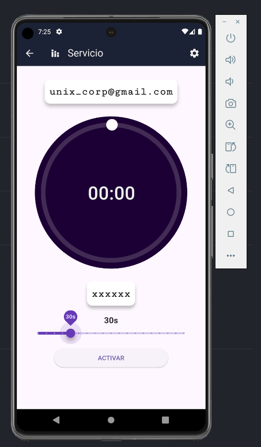

<h1 align="center">🔐 TOTP-Unix</h1>

<p align="center">
  Autenticador TOTP (Time-based One-Time Password) construido con Flutter.
</p>

## 📥 Descargar app

Puedes descargar la versión más reciente de la aplicación directamente desde la sección de [Releases](https://github.com/qxth/UTOTP/releases) del repositorio.

> ✅ Ideal si no deseas compilar el proyecto localmente.

<p align="center">
  <a href="https://github.com/qxth/UTOTP/releases">
    
  </a>
</p>

## ℹ️ Información Importante

Si utilizas los servicios de **Google** o **GitHub** para generar códigos TOTP, asegúrate de seleccionar esos servicios en la aplicación.  
Ambos ya vienen preconfigurados con los siguientes parámetros recomendados:

- **Tiempo:** <span style="color: #ff6b6b; font-weight: bold;">30 segundos</span> ⏱️
- **Algoritmo:** SHA1
- **Dígitos:** 6

> 🛠️ El servicio llamado **"Otro"** te permite personalizar estos campos según los requerimientos del proveedor TOTP que elijas (por ejemplo, cambiar el tiempo, algoritmo o número de dígitos).

<div align="center">
  
</div>

---

# 🚀 Desplegar por tu cuenta

Establecer el canal de Flutter:

```bash
flutter channel stable
```

Instala las dependencias del proyecto:

```bash
flutter pub get
```

---

### 📦 Construir para diferentes plataformas

> Más detalles en <a href="https://docs.flutter.dev/deployment" target="_blank" rel="noopener noreferrer">docs</a>


<details>
<summary>Expandir</summary>

-  **Android** 

```bash
flutter build apk --release
```

*  **Windows**

```bash
flutter build windows --release
```

*  **Linux**

```bash
flutter build linux --release
```

*  **Web**

```bash
flutter build web --release
```

</details>

---

# ⚙️ Para Desarrollo 

## 🧹 Comandos adicionales dart

- Analizar archivos/carpetas dart

```bash
dart analyze lib
```

```bash
dart analyze lib/file.dart
```

- Reparacion de dart

```bash
dart fix --apply --code=unused_import --code=unnecessary_new --code=unnecessary_this --code=prefer_collection_literals --code=unnecessary_const --code=unnecessary_import --code=prefer_const_constructors --code=use_key_in_widget_constructors --code=duplicate_import --code=prefer_relative_imports
```

## 🧪 Pre-commits con Husky

<details>
<summary>Expandir</summary>

### 📋 Permisos Husky

```bash
chmod +x .husky/pre-commit
chmod +x .husky/commit-msg
```

- Opcional

```bash
chmod +x .husky/*
```

### ✅ Instalación de Husky

```bash
dart pub add --dev husky
```

```bash
dart run husky install
```

```bash
dart run husky add .husky/pre-commit "flutter test"
```

### 🧹 Integrar Lint con Husky

```bash
dart pub add --dev lint_staged
```

> 💡 Revisa el archivo de configuración para asegurar que se ejecute el lint en los archivos modificados.

### 🧹 Integrar Commitlint con Husky

```bash
dart pub add --dev commitlint_cli
```

```bash
dart run husky add .husky/commit-msg 'dart run commitlint_cli --edit $1'
```

### 💬 Realizar commits con Husky activado

```bash
git commit -a -m "mensaje"
```

</details>

---

## 📱 Comandos útiles de ADB

Asegúrate de tener `adb` instalado desde el Android SDK. Luego, puedes ejecutar los siguientes comandos desde PowerShell:

<details>
<summary>Expandir</summary>

### 🔍 Navega a la carpeta `platform-tools`

```powershell
cd $env:homepath\AppData\Local\Android\Sdk\platform-tools
```

### 📋 Ver dispositivos/emuladores conectados

```powershell
adb devices
```

> Muestra la lista de dispositivos o emuladores disponibles.

### 📦 Instalar una APK en un emulador

```powershell
adb -s <ip_emulador|nombre_emulador> install app.apk
```

> Reemplaza `<ip_emulador>` con la ip del dispositivo `127.x.x.x`

> Reemplaza `<nombre_emulador>` con un valor como `emulator-5554`

### 💻 Acceder a la terminal del emulador

```powershell
adb -s <ip_emulador|nombre_emulador> shell
```

> Ejecuta comandos directamente en el entorno del emulador.

### 🌐 Instalar una APK usando IP o nombre

```powershell
adb -s <ip_emulador|nombre_emulador> install app.apk
```

### 📦 Subir archivos desde host a emulador

```powershell
adb -s <ip_emulador|nombre_emulador> push "$env:homepath\Downloads\fichero.txt" /storage/emulated/0/Download
```

### 📦 Bajar archivos desde emulador a host

```powershell
adb -s <ip_emulador|nombre_emulador> pull /storage/emulated/0/Download/fichero.txt "$env:homepath\Downloads\"
```

> Útil para dispositivos conectados remotamente.

---

</details>

## 📋 Otras notas

### 📦 Visualizar markdown desde android studio

- Ir a Navigate > Search Everywhere > escribir `choose boot Java Runtime` y elegir el recomendado, instalar y reiniciar
- Nota: Cerrar todas las pestañas que tengan markdown y abrir de nuevo

## 🔗 Enlaces útiles

- [🔧 Integración de lint-staged y Husky en Flutter](https://thisiscem.medium.com/boosting-code-quality-in-your-flutter-projects-lint-staged-and-husky-integration-4bcee79bbb85)
